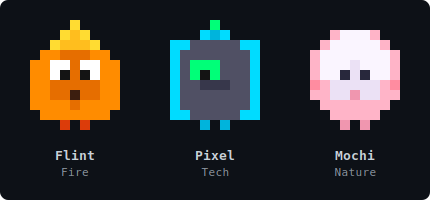
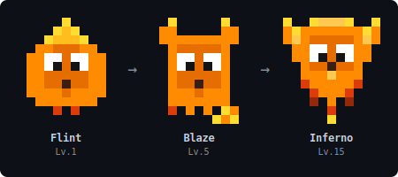
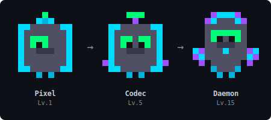
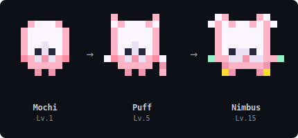
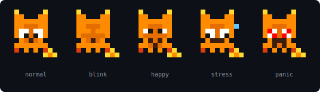

<div align="center">

```
  ████████╗ ██████╗ ██╗  ██╗██████╗ ██╗   ██╗██████╗ ███╗   ██╗
  ╚══██╔══╝██╔═══██╗██║ ██╔╝██╔══██╗██║   ██║██╔══██╗████╗  ██║
     ██║   ██║   ██║█████╔╝ ██████╔╝██║   ██║██████╔╝██╔██╗ ██║
     ██║   ██║   ██║██╔═██╗ ██╔══██╗██║   ██║██╔══██╗██║╚██╗██║
     ██║   ╚██████╔╝██║  ██╗██████╔╝╚██████╔╝██║  ██║██║ ╚████║
     ╚═╝    ╚═════╝ ╚═╝  ╚═╝╚═════╝  ╚═════╝ ╚═╝  ╚═╝╚═╝  ╚═══╝
```

**Choose your Tokemon. Write code. Watch it evolve. Track your Claude Code stats live.**

A pixel art companion that lives in your Claude Code status line — it blinks, reacts to your token usage, roasts your spending habits, and evolves as you write more code. Also happens to be a full session dashboard.

[](https://www.npmjs.com/package/tokburn)
[](https://www.npmjs.com/package/tokburn)
[](./LICENSE)
[](https://nodejs.org)

</div>

<p align="center">
  
</p>

## Two lines. That's it.

```bash
npm i -g tokburn
tokburn init
```

Pick your plan. Choose your creature. Give it a personality. Done. Your Tokemon hatches and starts living in your status line immediately.

---

## What you actually get

Your status line goes from this:

```
Opus 4.6 (1M context) | ctx 13%
```

To this -- a 6-line dashboard with a living creature:

```
 [Tokemon]  │ Opus 4.6 (1M context)·Max ━━━━━━────────────── 31%
 [sprite ]  │ 5h ◆◆◆◇◇◇◇◇◇◇ 27% 3h25m→10:00 | 7d ◇◇◇◇◇◇◇◇◇◇ 2%
 [sprite ]  │ +156 / -23 | ↓37K ↑152K | ⎇ main*
 [sprite ]  │ ╌╌╌╌╌╌╌╌╌╌╌╌╌╌╌╌╌╌╌╌╌╌╌╌╌╌╌╌╌╌╌╌╌╌╌╌╌╌╌╌╌╌╌╌
 [sprite ]  │ Lv.8 Blaze ▰▰▰▰▰▱▱▱ → Lv.9
             │ 🧠 "you code like someone who hates money"
```

Everything updates live. The sprite animates. The quips change. The bars fill up. You never hit a rate limit wall blind again.

### What each line tells you

| Line | What's there | Why it matters |
|---|---|---|
| 1 | Model, plan, context bar + % | Know when context is getting full before you lose it |
| 2 | 5-hour + 7-day rate limits with reset countdown | See exactly how close you are to hitting the wall |
| 3 | Lines written, tokens in/out, git branch | Track what Claude is actually doing |
| 4 | Divider | Your Tokemon lives below the stats |
| 5 | Level, name, XP progress bar | Watch your companion grow as you code |
| 6 | Animated emoji + personality quip | Your Tokemon's commentary on your session |

---

## Three starters. Three personalities. Your choice.

### Flint -- the fire type


Default personality: **Sassy.** Will roast your spending with a straight face.
```
"you code like someone who hates money"
"your rate limit called. it filed a restraining order."
"oh great. you again."
```

### Pixel -- the tech type


Default personality: **Hype.** Unhinged internet energy. Lives for big numbers.
```
"LEEROY JENKINS INTO THE RATE LIMIT!!"
"THEY WILL WRITE LEGENDS ABOUT THIS SESSION"
"chat is this real?? IS THIS REAL??"
```

### Mochi -- the nature type


Default personality: **Anxious.** Sweet, nervous, tries to be brave. Fails adorably.
```
"EVERYTHING IS ON FIRE AND I AM SMALL..."
"trying to be supportive but also AAAAAA..."
"oh... oh wow... i'm actually kind of... pretty??"
```

You can swap personalities independently of your Tokemon -- give Flint the anxious voice, give Mochi the sassy one. 152 unique quips across all combinations.

---

## They evolve

Your Tokemon earns XP from every line of code Claude writes. Across all projects, all sessions, always accumulating.

| Stage | When | What happens |
|---|---|---|
| Stage 1 | Start | Your starter form |
| **Stage 2** | **~5,000 lines** (Lv.5) | First evolution -- new sprite, new name, 30-second celebration |
| **Stage 3** | **~50,000 lines** (Lv.15) | Final form -- you earned this over weeks of real work |
| Post-15 | Forever | Levels keep climbing. Bragging rights. |

When your Tokemon evolves, the status line lights up gold for 30 seconds:
```
★ Lv.5 Blaze — EVOLVED! ★
```

---

## They're alive

Your Tokemon isn't static. It has 5 expressions that change in real-time:



| Expression | When it shows |
|---|---|
| Normal | Default idle |
| Blink | Every few seconds -- it's alive, not a sticker |
| Happy | Evolution, level-ups, milestones |
| Stressed | Rate limit at 60-84% -- your Tokemon feels the pressure |
| Panic | Rate limit at 85%+ -- X eyes, wide mouth, sweat drop |

The sprite animates at 1fps with expression cycling, emoji rotation, and quip changes. Your Tokemon reacts to what's actually happening in your session.

> **Requires Claude Code v2.1.97+** (run `claude update`). Make sure `CLAUDE_CODE_NO_FLICKER` is **not** set in your settings.

---

## Skills

Use these in any Claude Code session:

| Skill | What it does |
|---|---|
| `/tokburn-check` | Session health check -- context analysis, optimization tips |
| `/tokburn-plan` | Estimate token cost before starting a big task |
| `/tokemon-stats` | Your Tokemon's XP, level, evolution progress, lifetime stats |

---

## How it works (for the curious)

**No proxy. No env vars. No interception. No cloud.**

Claude Code sends session data (model, rate limits, tokens, lines) to a status line script via stdin every second. tokburn parses the JSON, loads your companion state from `~/.tokburn/companion.json`, renders the sprite, builds the 6-line layout, updates XP, and writes to stdout. The whole thing runs in under 5ms with zero external dependencies.

XP accumulates across all projects and sessions. Your one Tokemon grows with everything you do in Claude Code.

---

## Privacy

Your data never leaves your machine. No network requests. No telemetry. No accounts. No cloud. Everything is a local JSON file. [Read every line of code.](./tokburn-cli/)

---

## Contributing

Fork it, branch it, PR it. Conventional commits (`feat:`, `fix:`, `chore:`). Run `npm test` in `tokburn-cli/`.

---

[MIT](./LICENSE) -- Copyright 2026 tokburn contributors
